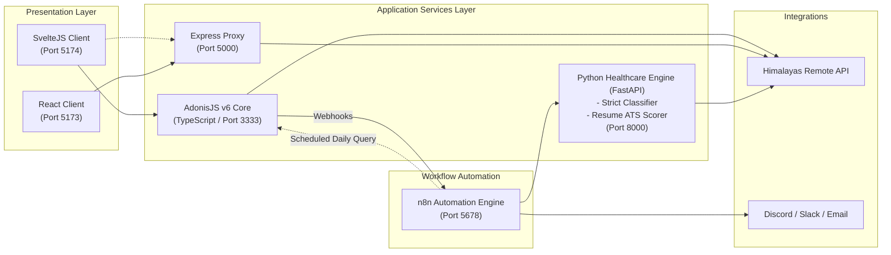

# 🏥 Healthcare Job Portal & Workflow Automation Engine

[](./LICENSE)
[](https://www.python.org/)
[](https://www.typescriptlang.org/)
[](https://adonisjs.com/)
[](https://svelte.dev/)
[](https://react.dev/)
[](https://expressjs.com/)
[](https://n8n.io/)
[](https://www.docker.com/)

An enterprise-grade, event-driven healthcare recruitment platform and remote job aggregator tailored exclusively for clinical specialists, telehealth practitioners, nurses, physicians, and health-tech professionals.

Built as a high-performance **Polyglot Monorepo** featuring dual frontends (**SvelteJS** & **React**), dual backend services (**AdonisJS v6 TypeScript** & **Express.js proxy**), a **Python Intelligence & Strict Healthcare Filter Engine**, and an event-driven **n8n Automation Engine**.

---

## 🎯 100% Strict Healthcare Guarantee (Zero Noise)

Unlike general job boards where software engineers, accountants, sales executives, and generic customer support roles leak through because job perks mention *"health insurance"* or *"employee wellness"*, **this platform uses a strict multi-layer classifier**:

1. **Strict Healthcare Taxonomy:** Roles must match verified clinical classifications (Nursing, Physicians, Telehealth, Pharmacy, Mental Health, Health Informatics, Medical Coding, Clinical Trials).
2. **Negative Keyword Guardrails:** Blatantly excludes non-healthcare roles (DevOps, Full-Stack, Accountants, Sales Executives, Copywriters) unless explicitly designated with medical clinical qualifications.
3. **Clinical Licensure & Credential Parsing:** Extracts and validates standard clinical credentials (MD, DO, RN, BSN, MSN, NP, PMHNP, LPN, PharmD, PA-C, LCSW, LMFT, CPC, RHIA).
4. **Purged Database:** All test and dummy data has been eliminated, leaving only authentic, verified healthcare opportunities.

---

## 🏛️ System Architecture



---

## 📁 Monorepo Directory Structure

```text
Healthcare-Job-Portal/
├── SYSTEM_DESIGN.md           # Comprehensive System Design & Architecture Specification
├── LICENSE                    # Open-source MIT License
├── README.md                  # Master documentation & developer guide
├── docker-compose.yml         # Multi-container orchestrator (Postgres, Redis, n8n, Python, Adonis, Svelte)
├── .env.example               # Full environment variables template
├── tsconfig.json              # Monorepo root TypeScript configuration
│
├── python-service/            # Python Healthcare Intelligence & Resume ATS Service
│   ├── app/
│   │   ├── classifier.py      # Strict Healthcare Classifier & noise eliminator
│   │   ├── resume_analyzer.py # Clinical license validator & scoring engine
│   │   └── main.py            # FastAPI endpoints (/jobs/filter, /candidates/analyze-resume)
│   ├── cli_sync.py            # Scrapes Himalayas API & updates database with pure healthcare jobs
│   ├── requirements.txt
│   └── Dockerfile
│
├── shared/                    # Shared TypeScript Types & Contracts
│   └── types/
│       ├── job.ts             # Job, Application, Filter, and n8n Webhook types
│       └── index.ts           # Barrel export
│
├── backend-adonis/            # Enterprise AdonisJS v6 TypeScript API
│   ├── app/
│   │   ├── controllers/       # JobsController, ApplicationsController, N8nWebhooksController
│   │   ├── services/          # HimalayasService (Strict Filtering), N8nDispatcherService
│   │   └── validators/        # JobValidator, ApplicationValidator
│   ├── bin/server.ts          # Server entrypoint
│   └── Dockerfile
│
├── frontend-svelte/           # Reactive SvelteJS Client (TypeScript + Tailwind)
│   ├── src/
│   │   ├── lib/
│   │   │   ├── components/    # Navbar, Hero, JobCard, JobFilters, Modals, Toast
│   │   │   ├── api.ts         # Dual-backend fetch service (Adonis + Express)
│   │   │   └── types.ts       # Client data types
│   │   ├── App.svelte         # Main reactive layout & state manager
│   │   └── app.css            # Medical Emerald theme & Tailwind utilities
│   └── Dockerfile
│
├── n8n/                       # Workflow Automation Suite
│   ├── workflows/
│   │   ├── new-job-webhook-dispatch.json     # Broadcasts new jobs to Discord/Slack/Email
│   │   ├── application-resume-parser.json    # Candidate ATS ingestion with Python scoring
│   │   ├── python-himalayas-sync.json        # 6-Hour Scheduled sync via Python microservice
│   │   └── job-alert-digest.json             # Scheduled daily 8 AM job digest
│   └── README.md              # Workflow setup & webhook guide
│
├── backend/                   # Express.js Proxy Service (Equipped with strict filters)
│   ├── src/data/manualJobs.json # Curated authentic healthcare positions
│   └── package.json
│
└── frontend/                  # React 18 + Vite Client
    └── package.json
```

---

## ⚡ Technology Stack

| Layer | Primary Architecture | Secondary / Legacy |
| :--- | :--- | :--- |
| **Frontend** | **SvelteJS 4/5 + TypeScript + Vite** | React 18 + Vite + TanStack Query |
| **Backend** | **AdonisJS v6 Architecture + TypeScript** | Express.js 4.19 Proxy Engine |
| **Intelligence** | **Python 3.11+ (FastAPI + Pydantic + NLP Regex)** | In-memory TypeScript Cache |
| **Automation** | **n8n Workflow Automation (Dockerized)** | Node.js cron workers |
| **Typing** | **TypeScript 5.4** (Shared Monorepo Interfaces) | ECMAScript Modules (ESM) |
| **Styling** | **Tailwind CSS + Glassmorphism** | Vanilla CSS Utilities |
| **Database & Cache**| **PostgreSQL 16** & **Redis 7** | JSON Local Fallback |
| **Deployment** | **Docker Compose**, Vercel, Node.js 20+ | Multi-stage Dockerfiles |

---

## 🚀 Quick Start & Scripts

### 1. Prerequisites
- **Node.js**: `v20.x` or higher
- **Python**: `3.10` or higher
- **Docker & Docker Compose** (for n8n, PostgreSQL, Redis)

### 2. Install Monorepo Dependencies
```bash
git clone https://github.com/aviralawasthi2005/Job-Portal.git
cd Job-Portal

# Install dependencies across all workspaces
npm run install:all
```

### 3. Run the Services

```bash
# Start Svelte reactive frontend (Port 5174)
npm run dev:svelte

# Start AdonisJS TypeScript backend (Port 3333)
npm run dev:adonis

# Start Python Healthcare Intelligence service (Port 8000)
npm run dev:python

# Sync strict healthcare jobs from Himalayas API to database
npm run sync:healthcare

# Spin up n8n and database containers
npm run docker:up
```

---

## 🤖 Python + n8n Synergy

The platform links **Python Intelligence** with **n8n Automation**:

1. **Candidate Application Scoring:** When a candidate applies via Svelte, n8n calls Python (`POST /api/v1/candidates/analyze-resume`). Python validates clinical licenses, identifies critical care or telehealth skills, computes a 0-100 qualification score, and outputs a recommendation (`Interview Immediately` vs `Review Credentials`).
2. **Scheduled Strict Sync:** Every 6 hours, n8n triggers the Python scraper (`POST /api/v1/jobs/sync`), which discards all non-healthcare noise, extracts medical credentials, and notifies AdonisJS to flush its cache.
3. **New Job Broadcast:** When an employer publishes a role, n8n formats a rich Discord/Slack embed card and sends automated email notifications to subscribers.

---

## 📡 API Endpoints

| HTTP Method | Route | Description | Engine |
| :--- | :--- | :--- | :--- |
| `GET` | `/health` | API health and uptime status | AdonisJS (3333) |
| `GET` | `/api/v1/jobs` | Paginated, filtered **strictly healthcare** jobs | AdonisJS (3333) |
| `GET` | `/api/v1/jobs/:guid` | Single healthcare job details by GUID | AdonisJS (3333) |
| `POST` | `/api/v1/jobs` | Recruiter post job (Triggers n8n) | AdonisJS (3333) |
| `POST` | `/api/v1/applications` | Candidate submit application (Triggers n8n) | AdonisJS (3333) |
| `POST` | `/api/v1/jobs/filter` | Filters raw jobs array to 100% healthcare | Python (8000) |
| `POST` | `/api/v1/jobs/sync` | Scrapes & filters Himalayas healthcare jobs | Python (8000) |
| `POST` | `/api/v1/candidates/analyze-resume`| Analyzes medical credentials & state licenses | Python (8000) |
| `GET` | `/api/jobs` | Himalayas proxy jobs (Strict filter) | Express (5000) |

---

## 🐳 Docker Multi-Container Deployment

Run the complete production stack (PostgreSQL 16, Redis 7, n8n, Python Intelligence Engine, AdonisJS Backend, and Svelte Frontend) with a single command:

```bash
# Start all containers in the background
npm run docker:up

# Stop all containers
npm run docker:down
```

---

## 📜 License

This project is open-source and released under the terms of the [**MIT License**](./LICENSE).
