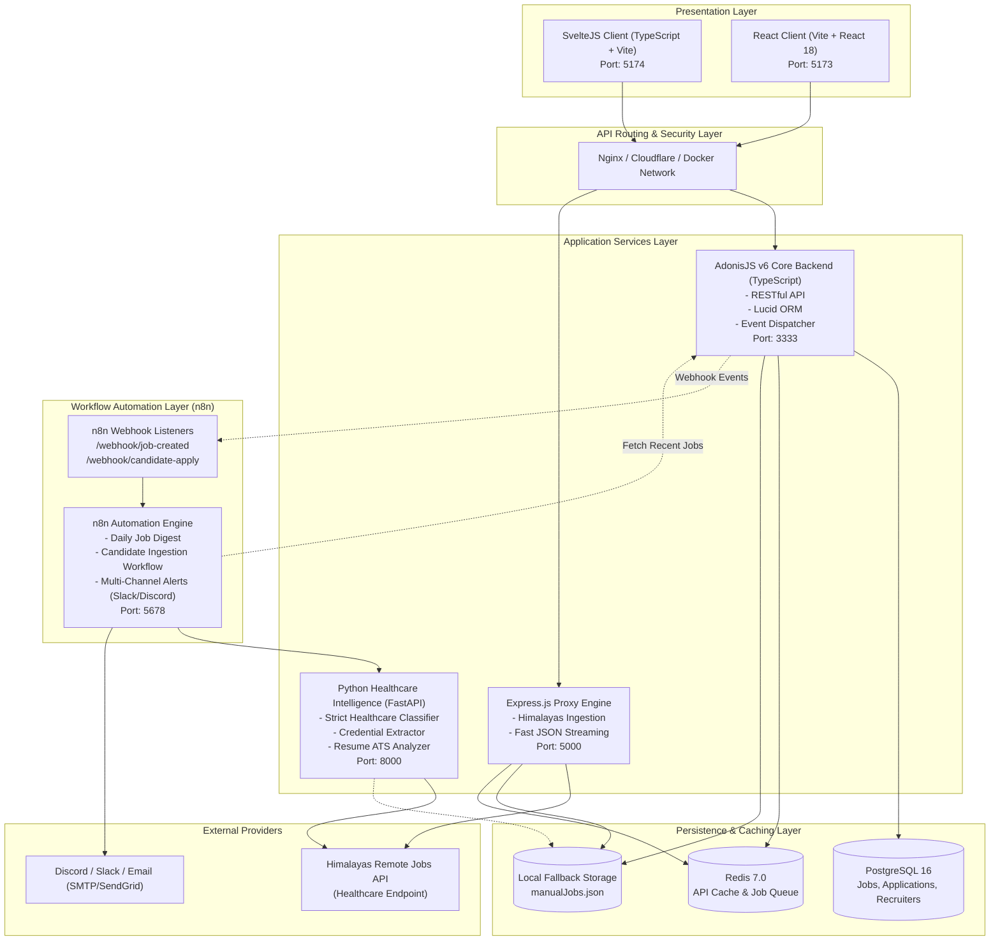
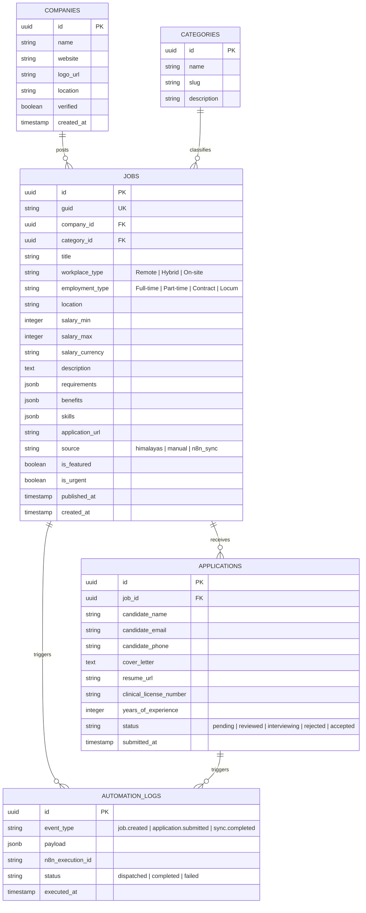
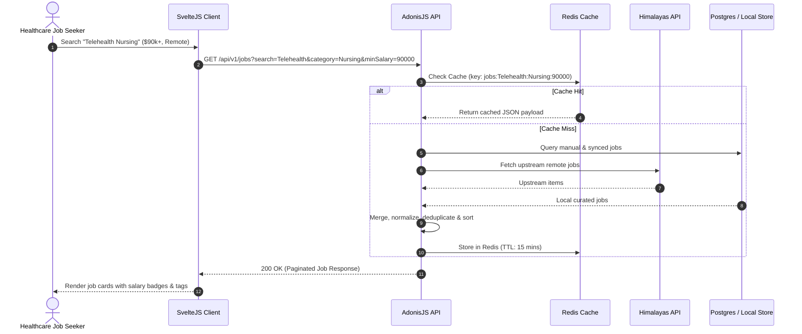
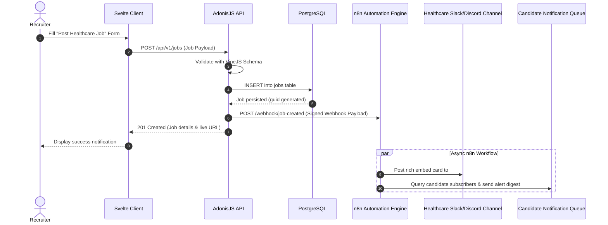
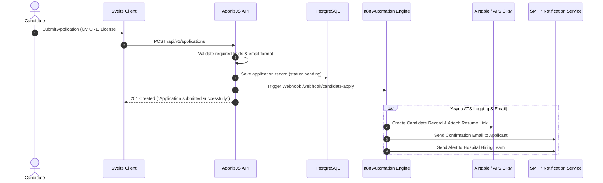
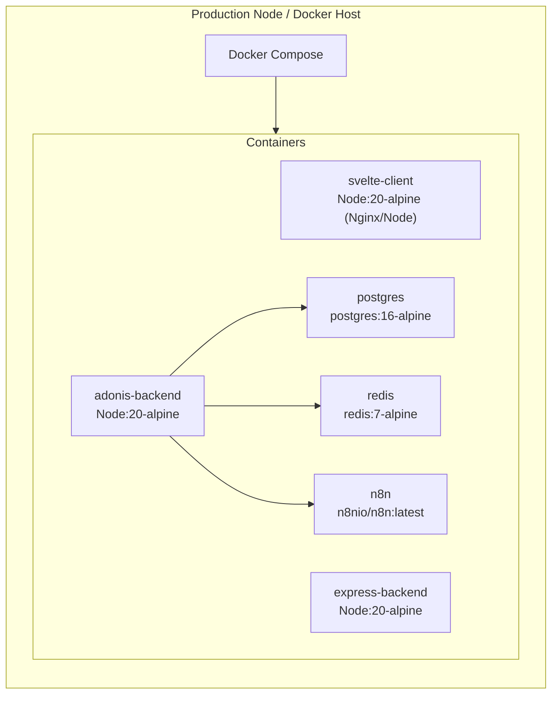

# System Design & Architecture Specification
## Healthcare Job Portal & Automation Platform

**Version:** 2.0.0  
**Status:** Approved & Implemented  
**Architecture:** Event-Driven Polyglot Monorepo (TypeScript, AdonisJS v6, SvelteJS, React, Express, n8n Automation Engine)

---

## 1. Executive Summary & Vision

The **Healthcare Job Portal** is an enterprise-grade recruitment and job aggregation platform tailored for the modern healthcare sector. It bridges the gap between healthcare institutions (hospitals, telehealth clinics, research labs, health-tech startups) and qualified medical and digital health professionals (nurses, physicians, medical informatics engineers, clinical researchers, pharmacists).

### Key Architectural Pillars
- **Dual-Engine Frontend Options:**
  - **SvelteJS Client (`frontend-svelte`):** Ultra-lightweight, zero-virtual-DOM, reactive client delivering sub-second initial loads, micro-animations, and fluid filtering.
  - **React Client (`frontend`):** Component-rich React 18 single-page application powered by TanStack Query and Lucide icons.
- **Dual Backend Architectures:**
  - **AdonisJS v6 Service (`backend-adonis`):** Full-featured TypeScript enterprise backend with IOC container, request validators, Lucid ORM data models, and event dispatchers.
  - **Express Service (`backend`):** High-throughput microservice proxy handling fast JSON responses and Himalayas API aggregation.
- **Python Healthcare Intelligence & Resume Engine (`python-service`):**
  - **Strict Healthcare Filtering:** Eliminates non-healthcare roles (software engineers, accountants, sales) and perk false positives.
  - **Clinical Licensure & Credential Extraction:** Recognizes MD, DO, RN, BSN, MSN, NP, PMHNP, LPN, PharmD, PA-C, LCSW, LMFT, CPC, RHIA.
  - **Resume Qualification Scorer:** Analyzes applicant clinical licenses and years of experience.
- **Workflow Automation with n8n (`n8n`):**
  - Webhook-driven candidate intake, resume processing, scheduled job syncs, and multi-channel candidate alert digests (Slack, Discord, Email).
- **Resilience & Caching:**
  - Cache-aside strategy with in-memory / Redis caching to minimize external API limits and ensure 99.9% uptime even during upstream degradation.

---

## 2. High-Level System Architecture

---

## 3. Component Deep Dive

### 3.1 SvelteJS Client (`frontend-svelte`)
- **Technology:** Svelte 5 / SvelteKit / Vite, TypeScript, Tailwind CSS, Lucide Svelte.
- **Responsibilities:**
  - Client-side reactive filtering (specialty, salary bracket, workplace mode: Remote / On-site / Hybrid).
  - Instant job search with debounce.
  - Interactive job detail drawer and slide-out modal.
  - Direct candidate application with resume link validation and instant feedback.
  - Recruiter job posting submission dialog with client-side schema validation.

### 3.2 AdonisJS v6 Backend (`backend-adonis`)
- **Technology:** AdonisJS v6, TypeScript, VineJS schema validator, Lucid ORM, Node.js v20+.
- **Key Modules:**
  - `JobsController`: Implements query parsing, category normalization, multi-source union (Himalayas remote + internal manual posts), pagination, and caching.
  - `ApplicationsController`: Handles applicant intake, validates clinical licenses/experience, stores application records, and emits `application.submitted` event.
  - `N8nWebhooksController`: Two-way integration endpoint for receiving automated updates and trigger dispatches from n8n workflows.
  - `N8nDispatcherService`: HTTP client sending signed webhook payloads to the n8n automation engine.

### 3.3 n8n Workflow Automation Suite (`n8n/`)
- **Technology:** n8n Workflow Automation (Dockerized), Webhook Triggers, Cron Schedules, HTTP Nodes.
- **Implemented Workflows:**
  1. **New Job Multi-Channel Dispatch (`new-job-alert-digest.json`):**
     - When a recruiter posts a new healthcare position or a high-priority opening is scraped, n8n formats an interactive rich card and posts to Discord, Slack, and candidate newsletter lists.
  2. **Job Application & ATS Processor (`job-application-processor.json`):**
     - Captures applicant data from AdonisJS webhook, parses resume link, checks qualification keywords (e.g. RN, MD, PharmD), stores candidate in applicant tracking system (Airtable / Google Sheets / Postgres), and sends an automated confirmation email to the candidate.
  3. **Himalayas Sync Scheduler (`himalayas-sync-scheduler.json`):**
     - Runs on a cron schedule (e.g. every 6 hours), queries Himalayas healthcare job endpoints, deduplicates entries against existing database records, and flushes Redis cache.

---

## 4. Entity Relationship Diagram (ERD)

---

## 5. Sequence Diagrams

### 5.1 Candidate Search & Cached Query Flow

### 5.2 Recruiter Job Posting & n8n Automation Pipeline

### 5.3 Candidate Application & Automated Resume Intake

---

## 6. Security, Resilience & Quality Attributes

| Attribute | Implementation Strategy |
| :--- | :--- |
| **Type Safety** | End-to-end TypeScript interfaces shared via `@shared/types/job.ts`. |
| **Input Validation** | VineJS / Zod schema validation on all POST/PUT routes to prevent injection or malformed data. |
| **CORS Policy** | Strict origin whitelisting allowing only configured frontend origins in production. |
| **Rate Limiting** | Express-rate-limit & Adonis rate limiter (100 req/min per IP for reads; 10 req/min for posts). |
| **Fault Tolerance** | If Himalayas API is down or rate-limited, the system falls back seamlessly to cached/local storage. |
| **Idempotency** | Webhook deliveries use unique event UUIDs to prevent duplicate notifications in n8n. |

---

## 7. Deployment & Infrastructure Architecture

---

## 8. Summary of Deliverables in this Workspace

1. **System Design (`SYSTEM_DESIGN.md`):** This comprehensive architecture blueprint.
2. **License (`LICENSE`):** Open-source MIT License.
3. **TypeScript Definitions (`shared/types/`):** Unified schemas for jobs, filters, applications, and n8n webhooks.
4. **AdonisJS Backend (`backend-adonis/`):** TypeScript MVC architecture with controllers, validators, models, and n8n webhook dispatcher.
5. **SvelteJS Frontend (`frontend-svelte/`):** High-performance reactive Svelte client with rich medical theme, filters, modals, and job application flow.
6. **n8n Automation Suite (`n8n/`):** Pre-built workflow templates for daily digests, application parsing, and sync schedules.
7. **Monorepo Orchestration (`docker-compose.yml`, `package.json`, `.env.example`):** Multi-service dev and production runners.
